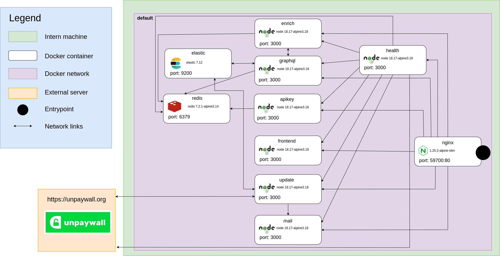

# ezunpaywall

ezunpaywall is a Unpaywall mirror hosted in France by Inist-CNRS of data from Unpaywall since 2020 and updated daily. Unpaywall is a metadata repository of free and open access electronic resources.
This app is available at https://unpaywall.inist.fr/.

**Table of content**
- [Description](#Description)
- [Network-flow](#Network-flow)
- [Installation](#Installation)
    - [Development](#Development)
        - [Prerequisites](#Prerequisites)
        - [Start](#Start)
        - [Tests](#Tests)
    - [Deployment](#Deployment)
        - [Prerequisites](#Prerequisites)
        - [Environment variables](#Environment-variables)
- [Data update](#Data-update)
- [API Graphql](#API-graphql)

## Description

ezunpaywall operates as a micro-service. It is updated daily with its own update service. Data is stored in an elastic index. To access this data, ezunpaywall offers 2 types of access:
- A graphql API for querying unpaywall data via one or more DOIs
- A file enrichment service that allows you to enrich a csv or jsonl file containing a column or a doi key.

These services are accessible via API keys, which can be managed by the API key service. The keys are stored in a redis database and can be accessed by the graphql service and enrich.
A web interface is also available as a demonstrator. It allows you to :
- Show data metrics
- Examples of how to use the graphql API and enrichment service
- openAPI documentation
- A contact form
- A server administration section
- A history of data update reports.
- A healthcare service makes sure that all its services work and communicate well together.

On the front, a nginx acts as a reverse proxy, redirecting all these services to a single entry point.

Each micro service : 
* [graphql](./src/graphql#ezunpaywall-graphql)
* [enrich](./src/enrich#ezunpaywall-enrich)
* [update](./src/update#ezunpaywall-update)
* [apikey](./src/apikey#ezunpaywall-apikey) 
* [frontend](./src/frontend#ezunpaywall-frontend)
* [health](./src/health#ezunpaywall-health)
* [nginx](./src/nginx#ezunpaywall-nginx)
* [mail](./src/mail#ezunpaywall-mail)
* [fakeUnpaywall](./src/fakeUnpaywall#ezunpaywall-fakeUnpaywall) (only for dev)

## Network-flow

ezunpaywall is made up of several services which are distributed in several docker containers.


## Installation

```bash
git clone https://github.com/ezpaarse-project/ezunpaywall 
```
### Development

#### Prerequisites

The tools you need to let ezunpaywall run are :
* docker
* npm

Command : 

```bash
# install dependencies
npm i

# create volume for elastic
docker-compose -f docker-compose.debug.yml run --rm elastic chown -R elasticsearch /usr/share/elasticsearch/ 
```
#### Start

```bash
# Start ezunpaywall as daemon
docker-compose -f docker-compose.debug.yml up -d

# Stop ezunpaywall
docker-compose -f docker-compose.debug.yml stop

# Get the status of ezunpaywall services
docker-compose -f docker-compose.debug.yml ps
```
#### Tests

To run tests, you need ezunpaywall to be launched in dev mode with fakeUnpaywall. With that, you can run test on.

```bash
# there are alias on root folder
$ ~/ezunpaywall npm run test
$ ~/ezunpaywall npm run test:apikey
$ ~/ezunpaywall npm run test:enrich
$ ~/ezunpaywall npm run test:graphql
$ ~/ezunpaywall npm run test:update

# you can run test for each service
$ ~/ezunpaywall/src/apikey npm run test
$ ~/ezunpaywall/src/enrich npm run test
$ ~/ezunpaywall/src/graphql npm run test
$ ~/ezunpaywall/src/update npm run test
```
### Deployment

#### Prerequisites

* docker
* docker compose
* Unpaywall data measured about 130Gb it is necessary to provide the necessary place on the hard drive

#### Environment variables

Create an environment file named `ezunpaywall.local.env.sh` and export the following environment variables. You can then source `ezunpaywall.env.sh`, which contains a set of predefined variables and is overridden by `ezunpaywall.local.env.sh`.


### Adjust system configuration for Elasticsearch

Elasticsearch has some [system requirements](https://www.elastic.co/guide/en/elasticsearch/reference/current/system-config.html) that you should check.

To avoid memory exceptions, you may have to increase mmaps count. Edit `/etc/sysctl.conf` and add the following line :

```ini
# configuration needed for elastic search
vm.max_map_count=262144
```
Then apply the changes : 
```bash
sysctl -p
```
### Start/Stop/Status

Before you start ezunpaywall, make sure all necessary environment variables are set.

```bash
# Start ezunpaywall as daemon
docker-compose up -d

# Stop ezunpaywall
docker-compose stop

# Get the status of ezunpaywall services
docker-compose ps
```
## Data update 

You can update your data via update snapshots provided by unpaywall on a weekly or daily basis (if you have API key).
in the update service, there is a cron that allows to automatically update the data from unpaywall, weekly or daily.
