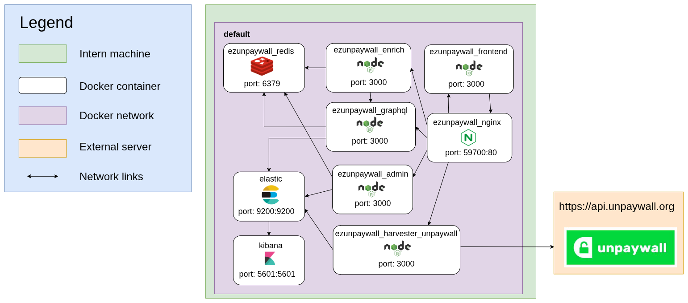

# ezunpaywall

ezunpaywall is an Unpaywall mirror hosted in France by Inist-CNRS, containing Unpaywall data since 2020 and updated daily. Unpaywall is a metadata repository of free and open access electronic resources.

The application is available at: https://unpaywall.inist.fr/

**Table of contents**
- [Description](#description)
- [Network-flow](#network-flow)
- [Installation](#installation)
  - [Steps to follow before starting](#steps-to-follow-before-starting)
  - [1. Prerequisites](#1-prerequisites)
  - [2. System configuration for Elasticsearch](#2-system-configuration-for-elasticsearch)
  - [3. Create API keys](#3-create-api-keys)
  - [4. Environment variables](#4-environment-variables)
  - [5. Development-specific steps](#5-development-specific-steps)
- [Start / Stop / Status](#start--stop--status)
- [Tests](#tests)
- [Data update](#data-update)
- [GraphQL API](#graphql-api)

## Description

ezunpaywall operates as a service, updated daily by its own update service. Data is stored in an Elasticsearch index. Two types of access are offered:
- a **GraphQL API** to query Unpaywall data via one or more DOIs;
- a **file enrichment service**, which lets you enrich a CSV or JSONL file containing a DOI column or key.

These services are accessible via API keys, managed by the API key service. Keys are stored in a Redis database, accessible by the GraphQL and enrich services.

A web interface serves as a demonstrator and allows you to:
- view data metrics;
- see usage examples for the GraphQL API and the enrichment service;
- consult the OpenAPI documentation;
- access a contact form;
- access a server administration section;
- view the history of data update reports.

A healthcheck service makes sure all services are running and communicating correctly with each other.

On the front end, nginx acts as a reverse proxy, routing all these services to a single entry point.

**Services:**
- [admin](./services/admin#ezunpaywall-admin)
- [harvester-unpaywall](./services/harvester-unpaywall#ezunpaywall-harvester-unpaywall)
- [graphql](./services/graphql#ezunpaywall-graphql)
- [enrich](./services/enrich#ezunpaywall-enrich)
- [frontend](./services/frontend#ezunpaywall-frontend)
- [nginx](./services/nginx#ezunpaywall-nginx)
- [fakeUnpaywall](./services/fakeUnpaywall#ezunpaywall-fakeUnpaywall) (dev only)

## Network-flow

ezunpaywall is made up of several services distributed across multiple Docker containers.



## Installation

### Steps to follow before starting

Follow the steps below in order:

1. [Prerequisites](#1-prerequisites)
2. [System configuration for Elasticsearch](#2-system-configuration-for-elasticsearch)
3. [Create API keys](#3-create-api-keys) — **mandatory**, otherwise the graphql and enrich services won't work
4. [Environment variables](#4-environment-variables)
5. [Development-specific steps](#5-development-specific-steps) (if applicable)
6. [Start the stack](#start--stop--status)

### 1. Prerequisites

- docker
- `npm` (development only)

For deployment, also plan for the necessary disk space: Unpaywall data in Elasticsearch (single node, index with 3 shards) is about 130GB, not counting storage for the raw Unpaywall files if you want to keep them.

### 2. System configuration for Elasticsearch

Elasticsearch has some [system requirements](https://www.elastic.co/guide/en/elasticsearch/reference/current/system-config.html) that you should check.

To avoid memory exceptions, you may need to increase the mmap count. Edit `/etc/sysctl.conf` and add the following line:

```ini
# configuration needed for elasticsearch
vm.max_map_count=262144
```

Then apply the changes:

```bash
sysctl -p
```

### 3. Create API keys (only in deployement)

ezunpaywall relies on API keys to secure access to the graphql and admin services: **without these keys, the services won't start correctly.** Set the required environment variables, then run the key creation scripts.

Make sure you have a cluster elasticsearch up.

```bash
export ELASTIC_NODE="<your instance of elasticsearch>"
export ELASTIC_ADMIN_USER="elastic"
export ELASTIC_ADMIN_PASSWORD="changeme"

bash services/graphql/tools/create-graphql-api-key.sh
bash services/harvester-unpaywall/tools/create-update-api-key.sh
```

Each script outputs an encoded API key: keep it, you'll need it in the next step.

### 4. Environment variables

Create an environment file named `ezunpaywall.local.env.sh` and export the necessary environment variables in it, **including the API keys generated in the previous step**. Then source `ezunpaywall.env.sh`, which contains a set of predefined variables, overridden by `ezunpaywall.local.env.sh`.

### 5. Development-specific steps

The following commands ensure correct file ownership for shared Docker volumes in development.

```bash
# install dependencies
npm i

# Fix Elasticsearch volume permissions
docker compose -f docker-compose-dev.yml run --rm elastic chown -R elasticsearch /usr/share/elasticsearch/

# Fix Node.js app volumes (admin, enrich, graphql)
docker compose -f docker-compose-dev.yml run --rm --entrypoint "" --user root admin chown -R node /usr/src/app/log
docker compose -f docker-compose-dev.yml run --rm --entrypoint "" --user root admin chown -R node /usr/src/app/data
docker compose -f docker-compose-dev.yml run --rm --entrypoint "" --user root enrich chown -R node /usr/src/app/log
docker compose -f docker-compose-dev.yml run --rm --entrypoint "" --user root enrich chown -R node /usr/src/app/data
docker compose -f docker-compose-dev.yml run --rm --entrypoint "" --user root graphql chown -R node /usr/src/app/log
```

## Start / Stop / Status

Before starting ezunpaywall, make sure all necessary environment variables are set.

Use `docker-compose.yml` for deployment, or `docker-compose-dev.yml` for development:

```bash
# start ezunpaywall as a daemon
docker-compose -f docker-compose.dev.yml up -d

# stop ezunpaywall
docker-compose -f docker-compose.dev.yml stop

# get the status of ezunpaywall services
docker-compose -f docker-compose.dev.yml ps
```

## Tests

To run tests, ezunpaywall must be started in dev mode with fakeUnpaywall. You can then run the tests:

```bash
# aliases available at the project root
npm run test
npm run test:admin
npm run test:harvester-unpaywall
npm run test:enrich
npm run test:graphql

# or per service
cd ezunpaywall/src/admin && npm run test
cd ezunpaywall/src/harvester-unpaywall && npm run test
cd ezunpaywall/src/enrich && npm run test
cd ezunpaywall/src/graphql && npm run test
```

## Data update

Data can be updated via snapshots provided by Unpaywall, on a weekly or daily basis (if you have an API key).
In the harvester-unpaywall service, a cron job allows the Unpaywall data update to be automated, either weekly or daily.
