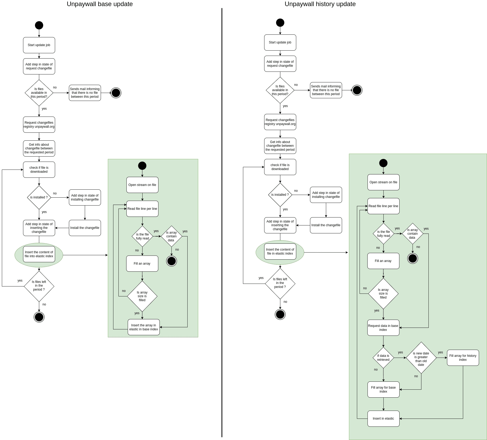

# ezunpaywall-admin

Admin service to manage API keys to access to graphql and enrich service.
This service manage unpaywall data with cron job.
During the job, a state allows you to monitor the current job.
This service is for administrators.

## Config

To set up this service, you can use environment variables. The config is displayed at startup. Sensitive data are not displayed.

```
# if sensitive data are not updated
warn: [config]: Unpaywall apikey has the default value 
warn: [config]: Elasticsearch password has the default value 
warn: [config]: Apikey has the default value 
warn: [config]: Redis password has the default value
{ 
  "nodeEnv": "development",
  "timezone": "Europe/Paris",
  "apikey": "********",
  "healthTimeout": 10000,
  "port": 3003,
  "smtp": {
    "host": "localhost",
    "port": 25
  },
  "notifications": {
    "sender": "ezunpaywall",
    "receivers": ["ezunpaywall@example.com"],
    "machine": "dev"
  },
  "unpaywall": {
    "url": "http://fakeunpaywall:3000",
    "apikey": "default",
    "email": "john.doe@example.com"
  },
  "elasticsearch": {
    "nodes": "http://elastic:9200",
    "username": "elastic",
    "password": "********",
    "maxBulkSize": 4000,
    "indexAlias": "upw",
    "timeout": 20000
  },
  "redis":  {
    "host": "redis",
    "port": "6379",
    "password": "********"
  },
  "cron": {
    "downloadSnapshot": {
      "schedule": "0 0 0 1 * *",
      "active": true
    },
    "dataUpdate": {
      "schedule": "0 0 0 * * *",
      "active": false,
      "index": "unpaywall",
      "interval": "day",
      "anteriority": 0
    },
    "dataUpdateHistory": {
      "schedule": "0 0 0 * * *",
      "active": false,
      "index": "unpaywall",
      "indexHistory": "unpaywall_history_*",
      "interval": "day"
    },
    "cleanFile": {
      "schedule": "0 0 0 * * *",
      "active": true,
      "changefileRetention": 30,
      "reportRetention": 30,
      "snapshotRetention": 100,
      "accessLogRetention": 365,
      "applicationLogRetention": 365,
      "healthcheckLogRetention": 30
    },
    "demoApikey": {
      "schedule": "0 0 0 * * *",
      "active": true,
      "count": 100000
    },
    "doiUpdate": {
      "schedule": "0 0 0 * * *",
      "active": true,
      "count": 100000
    }
  },
  "paths": {
    "log": {
      "applicationDir": "./log/application", 
      "accessDir": "./log/access",
      "healthcheckDir": "./log/healthcheck"
    },
    "data": {
      "changefilesDir": "./data/changefiles",
      "snapshotsDir": "./data/snapshots",
      "reportsDir": "./data/reports"
    }
  }
}
```

## Environment variables

### Application

| name | Description | Default |
| --- | --- | --- |
| NODE_ENV | Environment of node | development |
| TIMEZONE | Timezone of app used in cron | Europe/Paris |
| CRON_DEMO_APIKEY_COUNT | Count of demo request | 100000 | 
| ADMIN_APIKEY | Admin API key | changeme |
| HEALTH_TIMEOUT | Timeout to query the health route | 10000 |
| PORT | Port | 3003 |

### Mail

| name | Description | Default |
| --- | --- | --- |
| SMTP_HOST | SMTP host | localhost |
| SMTP_PORT | SMTP port | 25 |
| NOTIFICATIONS_SENDER | The sender for emails issued by ezunpaywall | ezunpaywall |
| NOTIFICATIONS_RECEIVERS | Recipients of the recent activity email | ezunpaywall@example.fr |
| NOTIFICATIONS_MACHINE | Environment of deployment | dev |

### unpaywall

| name | Description | Default |
| --- | --- | --- |
| UNPAYWALL_URL | Unpaywall api URL to access to changefiles | http://fakeunpaywall:3000 |
| UNPAYWALL_APIKEY | Unpaywall apikey to access to changefiles | changeme |
| UNPAYWALL_EMAIL | Email to request Unpaywall API | john.doe@exmaple.com | 

### Elasticsearch

| name | Description | Default |
| --- | --- | --- |
| ELASTICSEARCH_NODES | Elastic nodes URL separated by comma | http://elastic:9200 |
| ELASTICSEARCH_USERNAME | Username of elastic super user | elastic |
| ELASTICSEARCH_PASSWORD | Password of elastic super user | changeme |
| ELASTICSEARCH_MAX_BULK_SIZE | Max bulk size of update process | 4000 |
| ELASTICSEARCH_INDEX_ALIAS | Default alias of unpaywall data | upw |
| ELASTICSEARCH_TIMEOUT | Timeout in milliseconds of elastic client | 20000 |

### Redis

| name | Description | Default |
| --- | --- | --- |
| REDIS_HOST | Redis host | redis |
| REDIS_PORT | Redis port | 6379 |
| REDIS_PASSWORD | Redis password | changeme |

### Cron

#### Download snapshot

| name | Description | Default |
| --- | --- | --- |
| CRON_DOWNLOAD_SNAPSHOT_SCHEDULE | Schedule of cron | 0 0 0 1 * * |
| CRON_DOWNLOAD_SNAPSHOT_ACTIVE | Cron active or not at the start of service | true |

#### Data update

| name | Description | Default |
| --- | --- | --- |
| CRON_DATA_UPDATE_SCHEDULE | Schedule of cron | 0 0 0 * * * |
| CRON_DATA_UPDATE_ACTIVE | Cron active or not at the start of service | false |
| CRON_DATA_UPDATE_INDEX | Index where data is inserted | unpaywall |
| CRON_DATA_UPDATE_INTERVAL | Interval of changefile | day |
| CRON_DATA_UPDATE_ANTERIORITY | Number of days the update starts from today's date | 0 |

#### Data update history

| name | Description | Default |
| --- | --- | --- |
| CRON_DATA_UPDATE_HISTORY_SCHEDULE | Schedule of cron | 0 0 0 * * * |
| CRON_DATA_UPDATE_HISTORY_ACTIVE | Cron active or not at the start of service | true |
| CRON_DATA_UPDATE_HISTORY_INDEX | Index where data is inserted | unpaywall-base |
| CRON_DATA_UPDATE_HISTORY_INDEX_HISTORY | Index where history data is inserted | unpaywall-history |
| CRON_DATA_UPDATE_HISTORY_INTERVAL | Interval of changefile | day |

#### Clean file

| name | Description | Default |
| --- | --- | --- |
| CRON_CLEAN_FILE_SCHEDULE | Schedule of cron | 0 0 0 * * * |
| CRON_CLEAN_FILE_ACTIVE | Cron active or not at the start of service | true |
| CRON_CLEAN_FILE_CHANGEFILE_RETENTION | Detention time in days for changefiles from unpaywall | 30 |
| CRON_CLEAN_FILE_REPORT_RETENTION | Detention time in days for report of update process | 30 |
| CRON_CLEAN_FILE_SNAPSHOT_RETENTION | Detention time in days for snapshot from unpaywall | 150 |
| CRON_CLEAN_FILE_ACCESS_LOG_RETENTION | Detention time in days for access log | 365 |
| CRON_CLEAN_FILE_APPLICATION_LOG_RETENTION | Detention time in days for application log | 365 |
| CRON_CLEAN_FILE_HEALTHCHECK_LOG_RETENTION | Detention time in days for healthcheck log | 30 |

#### Demo apikey

| name | Description | Default |
| --- | --- | --- |
| CRON_DEMO_APIKEY_SCHEDULE | Schedule of cron | 0 0 0 * * * |
| CRON_DEMO_APIKEY_ACTIVE | Cron active or not at the start of service | true |
| CRON_DEMO_APIKEY_COUNT | Count of demo request | 100000 |


#### DOI update

| name | Description | Default |
| --- | --- | --- |
| CRON_DOI_UPDATE_SCHEDULE | Schedule of cron | 0 0 0 * * * |
| CRON_DOI_UPDATE_ACTIVE | Cron active or not at the start of service | true |
| CRON_DOI_UPDATE_LIMIT | DOI limit that can be updated | 100000 | 

## Command to set volume permissions (non root image docker)

```sh
docker compose run --rm --entrypoint "" --user root admin chown -R node /usr/src/app/log
docker compose run --rm --entrypoint "" --user root admin chown -R node /usr/src/app/data
```

## Activity diagram

Update process



## Data

3 types of file is generated by update job :
- changefile from unpaywall
- snapshot from unpaywall
- reports generated at the end of process

They are structured like this
```
data
├── changefiles
│   ├── changefile1.jsonl.gz
│   └── ...
├── snapshots
│   ├── snapshot1.jsonl.gz
│   └── ...
└── reports
    ├── report1.jsonl.gz
    └── ...
```

## Cron

- Demo apikey : Reset the counter at 100 000 of demo API key.
- Data update : Starts the data update process.
- Data history update : Starts the data update process and feeds the history.
- Download snapshot : Download current snapshot of unpaywall.
- Clean File : Deletes data or log files after a certain period of time.

## Log format

```
:date :ip :method :url :statusCode :userAgent :responseTime
```

## Open API

[open-api documentation](https://unpaywall.inist.fr/open-api?doc=admin)

## Test

```
# Functional tests
npm run test

# Unit tests
```

### Mirror quality

To check if unpaywall.inist.fr is equal to unpaywall API. you can use this test :

```sh
export ELASTIC_NODES="<elastic node of ezunpaywall>"
export ELASTIC_PASSWORD="<elastic password of ezunpaywall>"
export TEST_MIRROR_SIZE="<size of id tested>"

npm run test:mirror
```

Warning: Unpaywall is slow to respond.

At the end of the test, this should log something like that : 
```
OA: 100/100
Pure same: 75/100
```