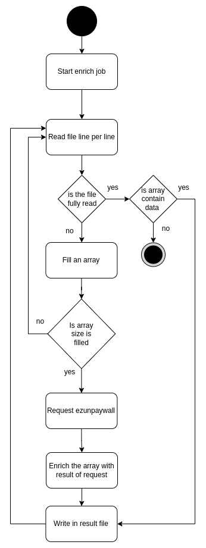

# ezunpaywall-enrich

Service that enrich csv and jsonl file with unpaywall data.

## Config

To set up this service, you can use environment variables. The config is displayed at startup. Sensitive data are not displayed.

```
# if sensitive data are not updated
warn: [config]: Redis password has the default value

info: {
  "nodeEnv": "development",
  "timezone": "Europe/Paris",
  "redis": {
    "host": "redis",
    "port": 6379,
    "password": "********"
  },
  "graphql": {
    "host": "http://graphql:3000"
  },
  "apikey": "********",
  "healthTimeout": 3000,
  "port": 3000
}
```

## Service environment variables

| Name | Description | Default |
| --- | --- | --- |
| NODE_ENV | Environment of node | development |
| TIMEZONE | Timezone of app used in cron | Europe/Paris |
| REDIS_HOST | Redis host | redis |
| REDIS_PORT | Redis port | 6379 |
| REDIS_PASSWORD | Redis password | changeme |
| GRAPHQL_URL | Graphql host | http://graphql:3000 |
| ADMIN_APIKEY | Admin API key | changeme |
| HEALTH_TIMEOUT | Timeout to query the health route | 3000 |
| PORT | Port | 3000 |

## Command to set volume permissions (non root image docker)

```sh
docker compose run --rm --entrypoint "" --user node enrich chown -R node /usr/src/app/log
docker compose run --rm --entrypoint "" --user node enrich chown -R node /usr/src/app/data
```

## Activity diagram

Enrich process



### Data

3 types of file is generated by enrich job :
- uploaded file
- enriched file
- states of enrich process

They are structured like this
```
data
├── enriched
│   ├── user01
|       ├── 00000000-0000-0000-0000-000000000001.csv
│       ├── 00000000-0000-0000-0000-000000000001.jsonl
│       ├── ...
│       └── 00000000-0000-0000-0000-000000000010.csv
│   └── user02
│       ├── 00000000-0000-0000-0000-000000000001.csv
│       ├── 00000000-0000-0000-0000-000000000001.jsonl
│       ├── ...
│       └── 00000000-0000-0000-0000-000000000010.csv
├── states
│   ├── user01
|       ├── 00000000-0000-0000-0000-000000000001.csv
│       ├── 00000000-0000-0000-0000-000000000001.jsonl
│       ├── ...
│       └── 00000000-0000-0000-0000-000000000010.csv
│   └── user02
│       ├── 00000000-0000-0000-0000-000000000001.csv
│       ├── 00000000-0000-0000-0000-000000000001.jsonl
│       ├── ...
│       └── 00000000-0000-0000-0000-000000000010.csv
└── upload
    ├── user01
        ├── 00000000-0000-0000-0000-000000000001.csv
        ├── 00000000-0000-0000-0000-000000000001.jsonl
        ├── ...
        └── 00000000-0000-0000-0000-000000000010.csv
    └── user02
        ├── 00000000-0000-0000-0000-000000000001.csv
        ├── 00000000-0000-0000-0000-000000000001.jsonl
        ├── ...
        └── 00000000-0000-0000-0000-000000000010.csv
```

### Cron

- Clean File : Deletes files generated by updates after 30 days.

## Log format

```
:date :ip :method :url :statusCode :userAgent :responseTime
```

## Open API

[open-api documentation](https://unpaywall.inist.fr/open-api?doc=enrich)

## Test

```
# Functional tests
npm run test

# Unit tests
# TODO
```