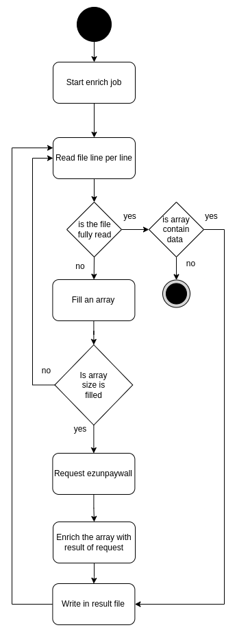

# ezunpaywall-enrich

Service that enrich csv and jsonl file with unpaywall data.

## Config

To set up this service, you can use environment variables. The config is displayed at startup. Sensitive data are not displayed.

- see [default config](./config/default.json)
- see [env variables](./config/custom-environment-variables.js)

## Command to set volume permissions (non root image docker)

```sh
docker compose run --rm --entrypoint "" --user root enrich chown -R node /usr/src/app/log
docker compose run --rm --entrypoint "" --user root enrich chown -R node /usr/src/app/data
```

## Activity diagram

Enrich process



### Data

3 types of file is generated by enrich job :
- uploaded file
- enriched file
- states of enrich process

They are structured like this
```
data
├── enriched
│   ├── user01
|   |   ├── 00000000-0000-0000-0000-000000000001.csv
│   |   ├── 00000000-0000-0000-0000-000000000001.jsonl
│   |   └── ...
│   └── user02
│       ├── 00000000-0000-0000-0000-000000000002.csv
│       ├── 00000000-0000-0000-0000-000000000002.jsonl
│       └── ...
├── states
│   ├── user01
|   |   ├── 00000000-0000-0000-0000-000000000001.csv
│   |   ├── 00000000-0000-0000-0000-000000000001.jsonl
│   |   └── ...
│   └── user02
│       ├── 00000000-0000-0000-0000-000000000002.csv
│       ├── 00000000-0000-0000-0000-000000000002.jsonl
│       └── ...
└── upload
    ├── user01
    |   ├── 00000000-0000-0000-0000-000000000001.csv
    |   ├── 00000000-0000-0000-0000-000000000001.jsonl
    |   └── ...
    └── user02
        ├── 00000000-0000-0000-0000-000000000002.csv
        ├── 00000000-0000-0000-0000-000000000002.jsonl
        └── ...
```

### Cron

- Clean File : Deletes files generated by updates after 30 days.

## Log format

```
:date :ip :method :url :statusCode :userAgent :responseTime
```

## Open API

[open-api documentation](https://unpaywall.inist.fr/open-api?doc=enrich)

## Test

```
# Functional tests
npm run test

# Unit tests
```