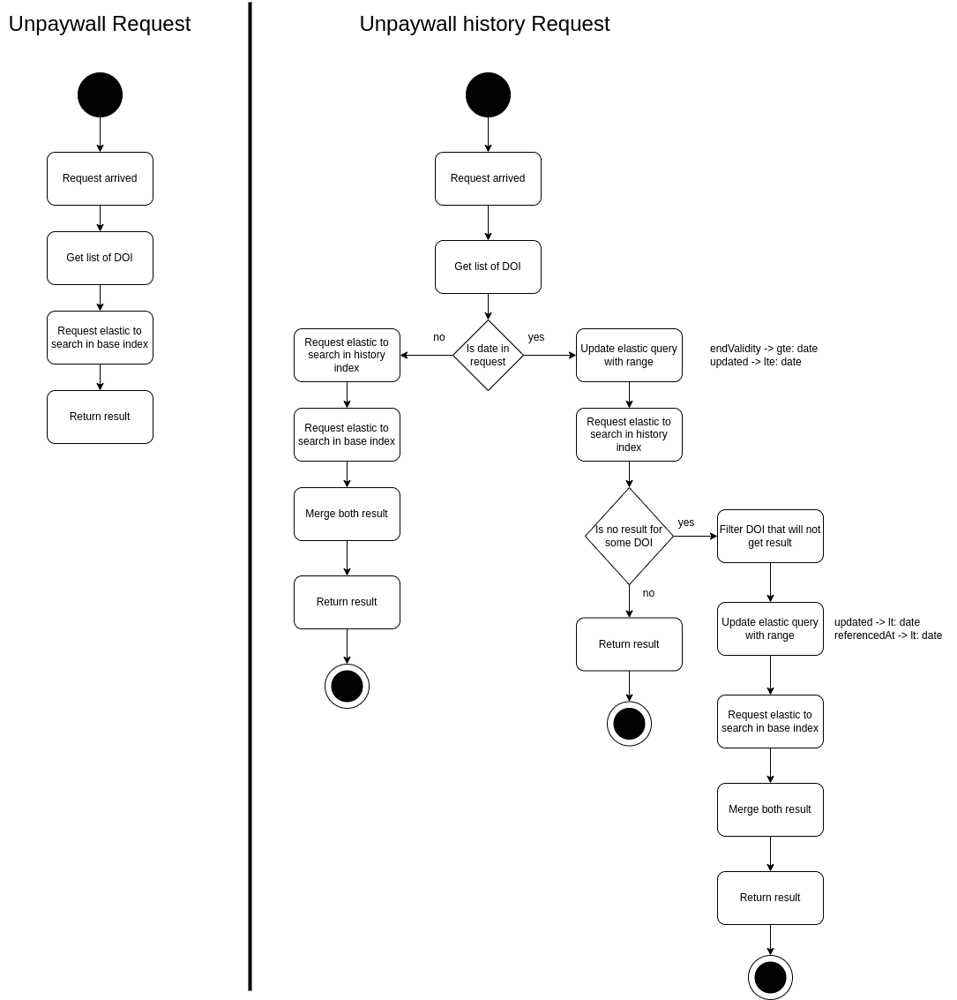

# ezunpaywall-graphql

A graphql API for querying unpaywall data via one or more DOIs.

## Config

To set up this service, you can use environment variables. The config is displayed at startup. Sensitive data are not displayed.

```
# if sensitive data are not updated
warn: [config]: Redis password has the default value
warn: [config]: Elastic password has the default value

info: {
  "nodeEnv": "development",
  "timezone": "Europe/Paris"
  "redis": {
    "host": "redis",
    "port": "6379",
    "password": "********"
  },
  "elasticsearch": {
    "host": "http://elastic",
    "port": 9200,
    "user": "elastic",
    "password": "********",
    "indexBase": "unpaywall_base",
    "indexHistory": "unpaywall_history"
  },
  "apikey": "********",
  "healthTimeout": 3000
}
```

## Environment variables

| name | default | description |
| --- | --- | --- |
| NODE_ENV | development | environment of node |
| TIMEZONE | Europe/Paris | timezone of app used in cron |
| REDIS_HOST | redis | redis host |
| REDIS_PORT | 6379 | redis port |
| REDIS_PASSWORD | changeme | redis password |
| ELASTICSEARCH_HOSTS | http://elastic | elasticsearch host |
| ELASTICSEARCH_PORT | 9200 | elasticsearch port |
| ELASTICSEARCH_USERNAME | elastic | elasticsearch admin username |
| ELASTICSEARCH_PASSWORD | changeme | elasticsearch admin password |
| ELASTICSEARCH_INDEX_ALIAS | upw | graphql entry point |
| HEALTH_TIMEOUT | 3000 | timeout to query the health route |
| ADMIN_APIKEY | admin API key | changeme |

## Activity diagram



### Object structure

[data-format](https://unpaywall.org/data-format)

## Graphql Request

### API key

You can put your API key in the query or in the header.
- In the query, use the key: `apikey`
- in the header, use the key: `x-api-key`

### Curl

```bash
# GET
curl --request GET \
  --url 'https://unpaywall.inist.fr/api/graphql?query=%7Bunpaywall(dois%3A%5B%2210.1001%2Fjama.2016.9797%22%5D)%7Bdoi%2C%20is_oa%2C%20oa_status%2C%20data_standard%2C%20updated%2C%20best_oa_location%7B%20evidence%20%7D%7D%7D' \
  --header 'Content-Type: application/json' \
  --header 'x-api-key: demo' 

# POST
curl --request POST \
  --url https://unpaywall.inist.fr/api/graphql \
  --header 'Content-Type: application/json' \
  --header 'x-api-key: demo' \
  --data '{"query":"{unpaywall(dois:[\"10.1001/jama.2016.9797\"]){doi,is_oa,oa_status,data_standard,updated,best_oa_location {endpoint_id}}}"}'
```

## Cron

One cron automatically update metrics of unpaywall data. the elastic request takes time and is saved locally.

## Log format

```
:date :ip :method :url :statusCode :userAgent :responseTime :countDOI
```

## Open API

[open-api documentation](https://unpaywall.inist.fr/open-api?doc=graphql)

## Test

```
# Functional tests
npm run test

# Unit tests
# TODO
```