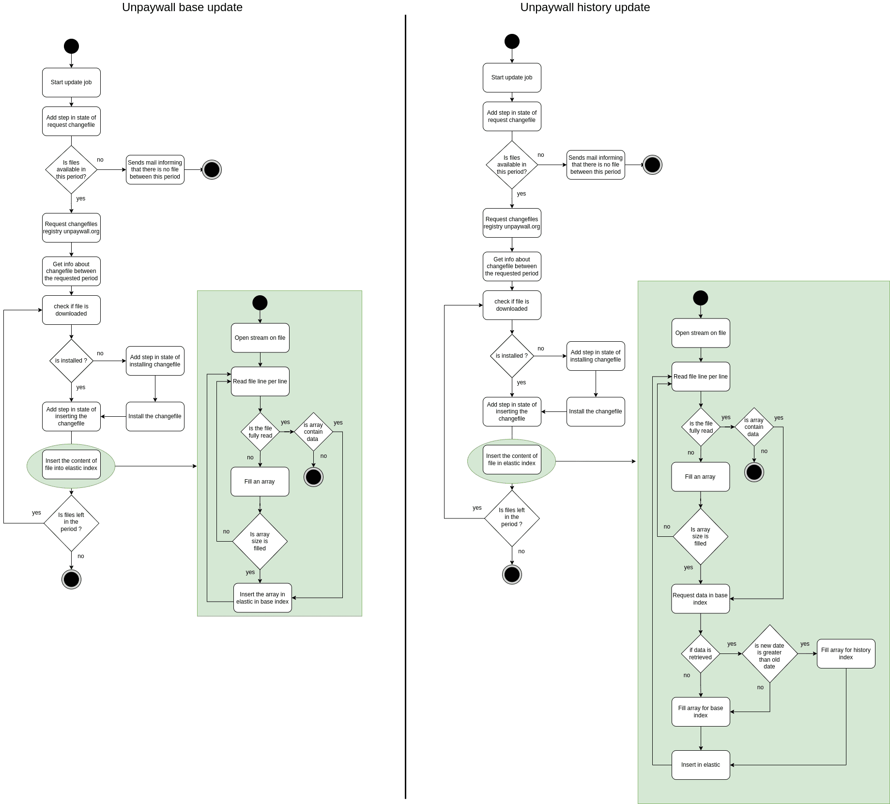

# ezunpaywall-harvester-unpaywall

This API manage unpaywall data with cron job.
During the job, a state allows you to monitor the current job.
This service is for administrators.

## Config

To set up this service, you can use environment variables. The config is displayed at startup. Sensitive data are not displayed.

- see [default config](./config/default.json)
- see [env variables](./config/custom-environment-variables.jsonc)

## Command to set volume permissions (non root image docker)

```sh
docker compose run --rm --entrypoint "" --user root admin chown -R node /usr/src/app/log
docker compose run --rm --entrypoint "" --user root admin chown -R node /usr/src/app/data
```

## Activity diagram

Update process



## Data

3 types of file is generated by update job :
- changefile from unpaywall
- snapshot from unpaywall
- reports generated at the end of process

They are structured like this
```
data
├── changefiles
│   ├── changefile1.jsonl.gz
│   └── ...
├── snapshots
│   ├── snapshot1.jsonl.gz
│   └── ...
└── reports
    ├── report1.jsonl.gz
    └── ...
```

## Cron

- demo-apikey : Reset the counter at 100 000 for the demo API key.
- data-update : Starts the data update process.
- download-snapshot : Download current snapshot of unpaywall.
- clean-File : Deletes data or log files after a certain period of time.
- update-doi : Resets the DOI counter directly from the Unpaywall API

## Log format

```
:date :ip :method :url :statusCode :userAgent :responseTime
```

## Open API

[open-api documentation](https://unpaywall.inist.fr/open-api?doc=admin)

## Test

```
# Functional tests
npm run test

# Unit tests
```

### Mirror quality

To check if unpaywall.inist.fr is equal to unpaywall API. you can use this test :

```sh
export ELASTIC_NODES="<elastic node of ezunpaywall>"
export ELASTIC_PASSWORD="<elastic password of ezunpaywall>"
export TEST_MIRROR_SIZE="<size of id tested>"

npm run test:mirror
```

Warning: Unpaywall is slow to respond.

At the end of the test, this should log something like that : 
```
OA: 100/100
Pure same: 75/100
```