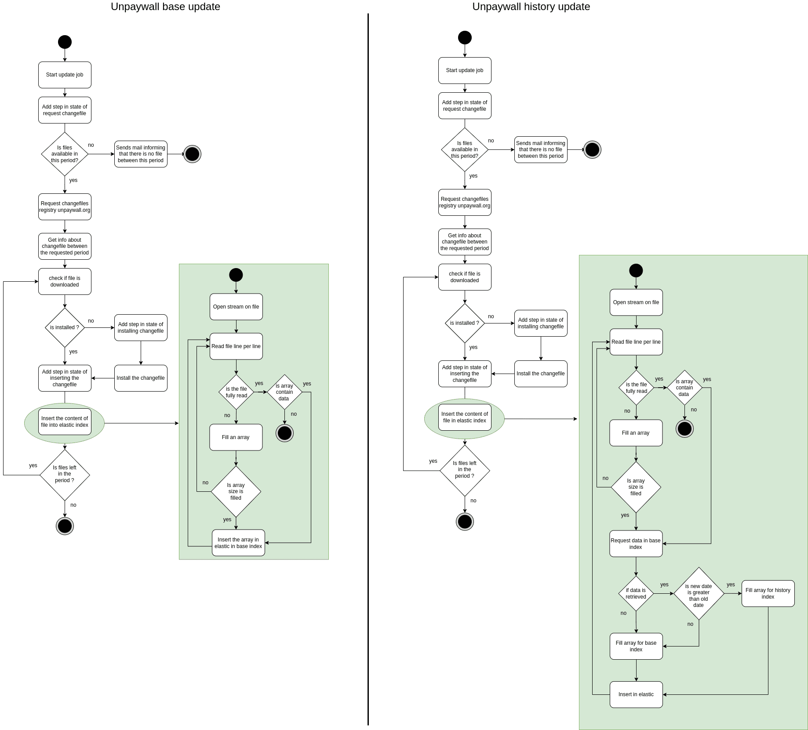

# ezunpaywall-update

Service that updates unpaywall data daily via a cron job.
During the job, a state allows you to monitor the current job.
This service is for administrators.

## Config

To set up this service, you can use environment variables. The config is displayed at startup. Sensitive data are not displayed.

```
# if sensitive data are not updated
warn: [config]: Unpaywall apikey has the default value
warn: [config]: Mail apikey has the default value
warn: [config]: elasticsearch password has the default value
warn: [config]: Apikey has the default value

info: {
  "nodeEnv": "development",
  "accessLogRotate": false,
  "timezone": "Europe/Paris",
  "unpaywall": {
    "host": "http://fakeunpaywall:3000",
    "apikey": "********"
  },
  "mail": {
    "host": "http://mail:3000",
    "apikey": "********"
  },
  "elasticsearch": {
    "host": "http://elastic",
    "port": 9200,
    "user": "elastic",
    "password": "********",
    "maxBulkSize": 4000,
    "indexAlias": "upw",
    "timeout": 20000
  },
  "unpaywallCron": {
    "schedule": "0 0 0 * * *",
    "active": false,
    "index": "unpaywall",
    "interval": "day"
  },
  "unpaywallHistoryCron": {
    "schedule": "0 0 0 * * *",
    "active": false,
    "indexBase": "unpaywall_base",
    "indexHistory": "unpaywall_history",
    "interval": "day"
  },
  "apikey": "********",
  "healthTimeout": 3000
}
```

## Environment variables

| name | default | description |
| --- | --- | --- |
| NODE_ENV | development | environnement of node |
| ACCESS_LOG_ROTATE | false | use local daily rotation for log |
| TIMEZONE | Europe/Paris | timezone of app used in cron |
| UNPAYWALL_HOST | http://fakeunpaywall:3000 | unpaywall api host to access to changefiles |
| UNPAYWALL_APIKEY | changeme | unpaywall apikey to access to changefiles |
| MAIL_HOST | http://mail:3000 | mail service host |
| MAIL_APIKEY | changeme | mail apikey |
| ELASTICSEARCH_HOSTS | http://elastic | elastic host |
| ELASTICSEARCH_PORT | 9200 | elastic port |
| ELASTICSEARCH_USERNAME | elastic | username of elastic super user |
| ELASTICSEARCH_PASSWORD | changeme | password of elastic super user |
| ELASTICSEARCH_MAX_BULK_SIZE | 4000 | max bulk size of update process |
| ELASTICSEARCH_INDEX_ALIAS | upw | default alias of unpaywall data |
| UNPAYWALL_CRON_SCHEDULE | 0 0 0 * * * | schedule of unpaywall cron |
| UNPAYWALL_CRON_ACTIVE | false | state of unpaywall cron |
| UNPAYWALL_CRON_INDEX | unpaywall | index of unpaywall process of cron |
| UNPAYWALL_CRON_INTERVAL | day | interval of unpaywall process of cron |
| UNPAYWALL_HISTORY_CRON_SCHEDULE | 0 0 0 * * * | schedule of unpaywall history cron |
| UNPAYWALL_HISTORY_CRON_ACTIVE | false | state of unpaywall history cron |
| UNPAYWALL_HISTORY_CRON_INDEX_BASE | unpaywall_base | index base unpaywall used for cron |
| UNPAYWALL_HISTORY_CRON_INDEX_HISTORY | unpaywall_history | index history unpaywall used for cron |
| UNPAYWALL_HISTORY_CRON_INTERVAL | day | interval of unpaywall history process of cron |
| UPDATE_APIKEY | changeme | update apikey to start update process |
| HEALTH_TIMEOUT | 3000 | timeout to query the health route |

## Activity diagram

Update process



### Object structure

[data-format](https://unpaywall.org/data-format)

### Data

2 types of file is generated by update job :
- update file from unpaywall
- reports
They are structured like this
```
data
├── snapshots
│   ├── 2020-01-01-snapshot.jsonl.gz
│   ├── ...
│   └── 2020-12-01-changefile.jsonl.gz
├── unpaywall
│   └── reports
│       ├── 2020-01-01_12:24:29.json
│       ├── ...
│       └── 2020-12-01_10:32:20.json
└── unpaywallHistory
    └── reports
        ├── 2020-01-01_10:00:00.json
        ├── ...
        └── 2020-12-01_10:00:00.json
```

### Cron

3 crons can be used on this service

**File**

This cron automatically deletes files generated by updates that are more than 30 days old.

**unpaywall**

This cron automatically executes the unpaywall data update job. This cron config can be updated using the API.

```
{
  "index": "unpaywall", // elastic index where data will be inserted
  "interval": "day", // update file register interval (week or day)
  "name": "update", // name of cron
  "schedule": "0 0 0 * * *", // schedule of cron
  "active": false // if is active or not
}
```

**unpaywallHistory**

This cron automatically updates unpaywall data and populates the history. This cron config can be updated using the API.

```
{
  "indexBase": "unpaywall_base", // elastic index where the unpaywall base data will be inserted
  "indexHistory": "unpaywall_history", // elastic index where the unpaywall history data will be inserted
  "interval": "day", // update file register interval (week or day)
  "name": "update", // name of cron
  "schedule": "0 0 0 * * *", // schedule of cron
  "active": false // if is active or not
}
```

### Elastic mapping

- [unpaywall](./mapping/unpaywall.json)
- [unpaywall_base](./mapping/unpaywall_base.json)
- [unpaywall_history](./mapping/unpaywall_history.json)

## Log format

```
:ip ":user" [:date[clf]] ":method :url HTTP/:http-version" :status :res[content-length] ":referrer" ":user-agent"
```

## Open API

[open-api documentation](https://unpaywall.inist.fr/open-api?doc=update)

## Test

```
# Functional tests
npm run test
# Unit test
# it's your turn to play
```